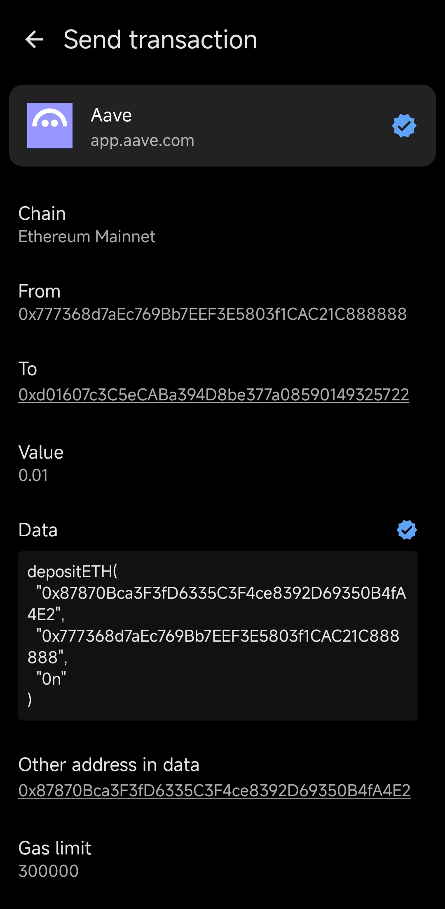
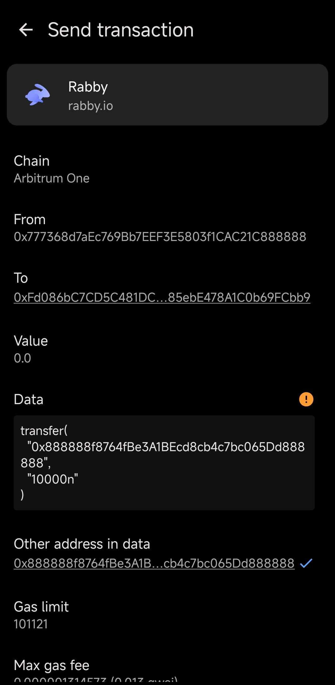

  

  
  

 

# Megnat

Megnat is a **third-party** / **non-official** wallet app for Tangem cards.

It is created to unleash the full potential of Tangem cards and provide a possibly better experience for certain use cases.

> Currently only available on Android, iOS support is probably coming.

## Highlights

- 🕵️ Transaction data decoding & verification against source code if available.
- 📑 Add multiple wallets on a single card.
- 🔑 Import & sign with **private key wallet** (so your wallet with vanity address can be safely stored on the card).
- 💰 Respect dApps' gas price settings, big big money saved over time.
- 🔌 Custom chains support for advanced users.

## Screenshots

  
  
  
  
  

## Downloads

Megnat is available on [Google Play](https://play.google.com/store/apps/details?id=com.megnat).

You can also find the latest version of the app on [GitHub Releases](https://github.com/vilicvane/megnat/releases/latest).

> Packages are built directly using GitHub Actions from source code with signed build provenance [attestations](https://github.com/vilicvane/megnat/attestations) that can be verified by yourself.

## A signing app

Megnat uses WalletConnect just like Tangem, but is solely built as a **signing app**, meaning built-in token management and DeFi features are non-goals.

## EVM-only

Currently it is **EVM-only**, and there is no plan to support other chains unless it is highly requested.

## Roadmap

- [ ] iOS support.
- [ ] QR-code based (air-gapped) connection.
- [ ] Security key (if possible).
- [x] Transaction data decoding.
- [ ] Pending transactions (to replace or cancel).
- [x] Card backup.

## Support our work

- Buy Tangem cards using Megnat [referral link](https://megnat.app/tangem).
- Donate to `0x777368d7aEc769Bb7EEF3E5803f1CAC21C888888`.

## License

MIT License.
